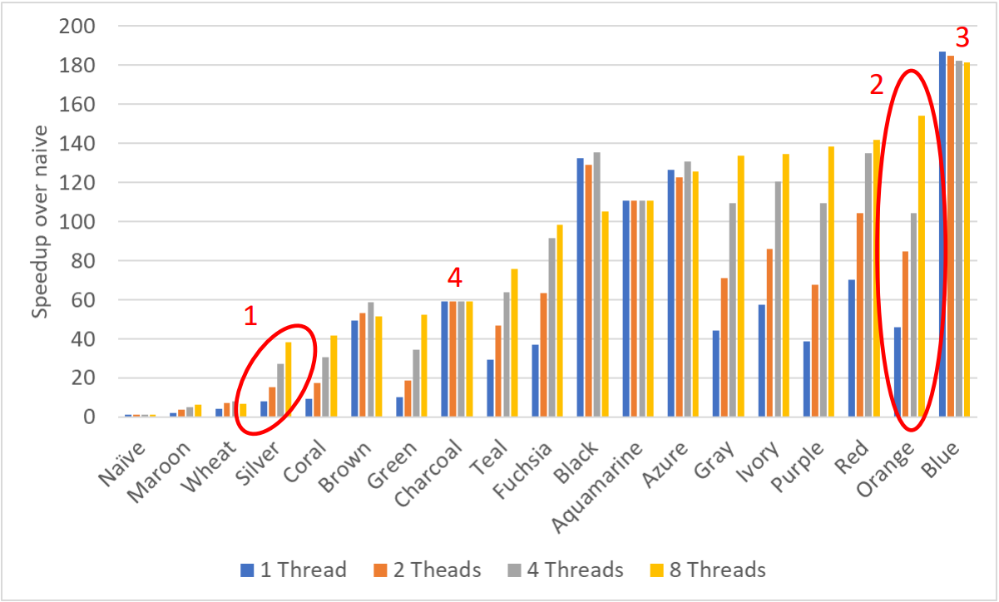

# Heat dissipation stencil accelerator

## Result

- Top 5 in the competition (I am Ivory)
- 140x faster compared to naive implementation in 8 threads

## Task done

1. Thread pool implementation
2. AVX instructions
3. Cache aware optimization (reduced 30% of cache misses)
