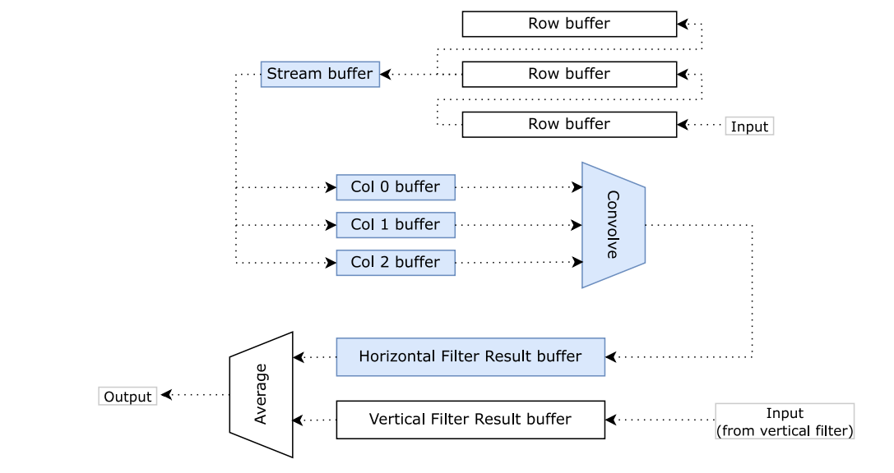
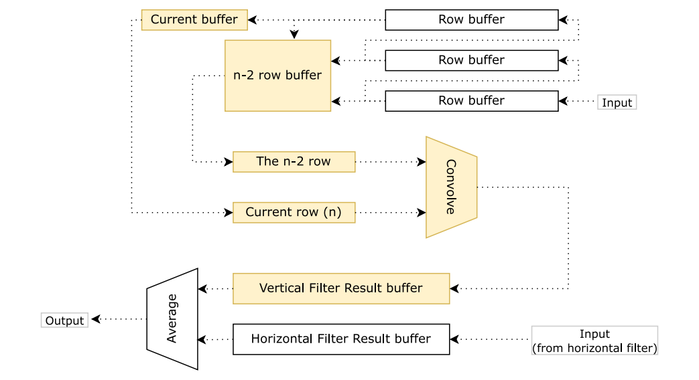
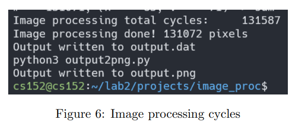

# CNN inference accelerator in FPGA

## Architecture

1. Implemented stream buffers and row/col buffer
2. Using row and col buffers to simulate 2D convolution

### Horizontal filter

### Vertical filter

## Result

Please also check [Report](report.pdf) for more details